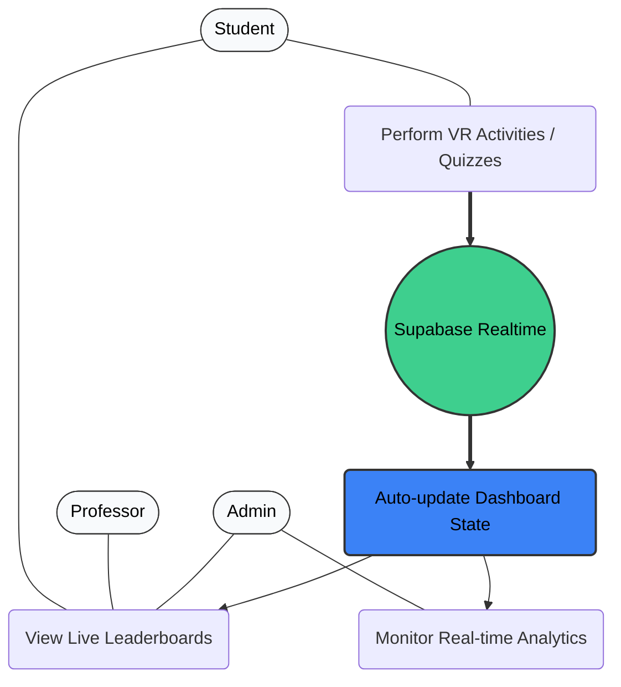
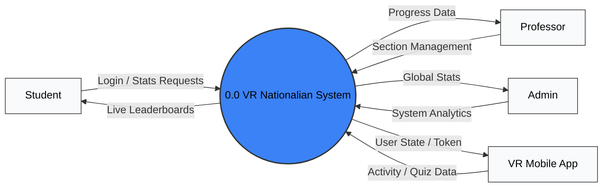
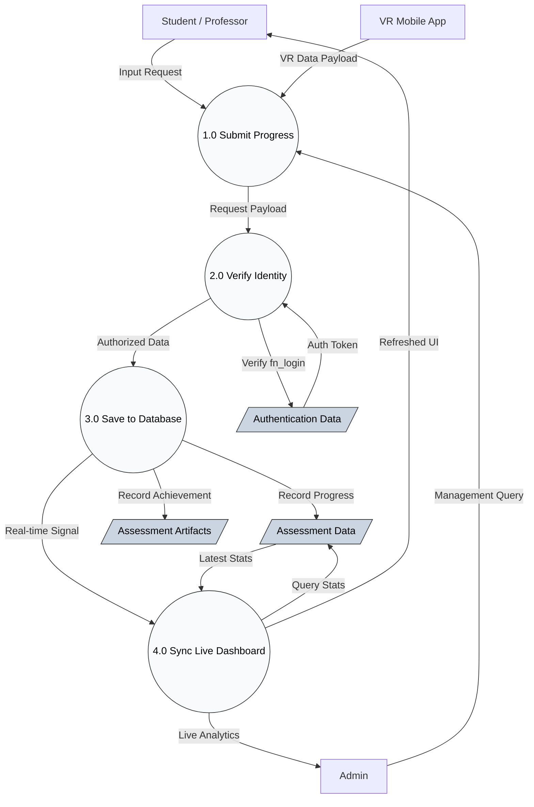
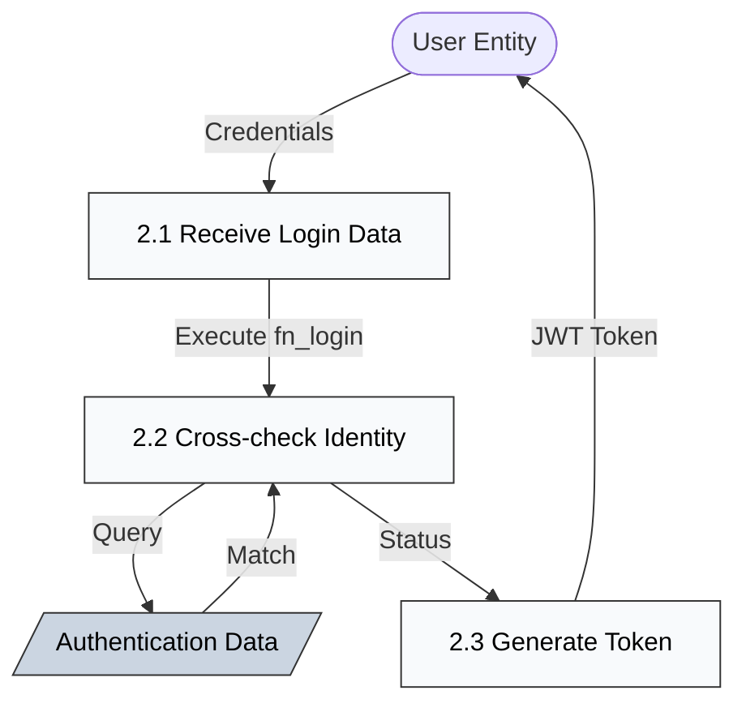
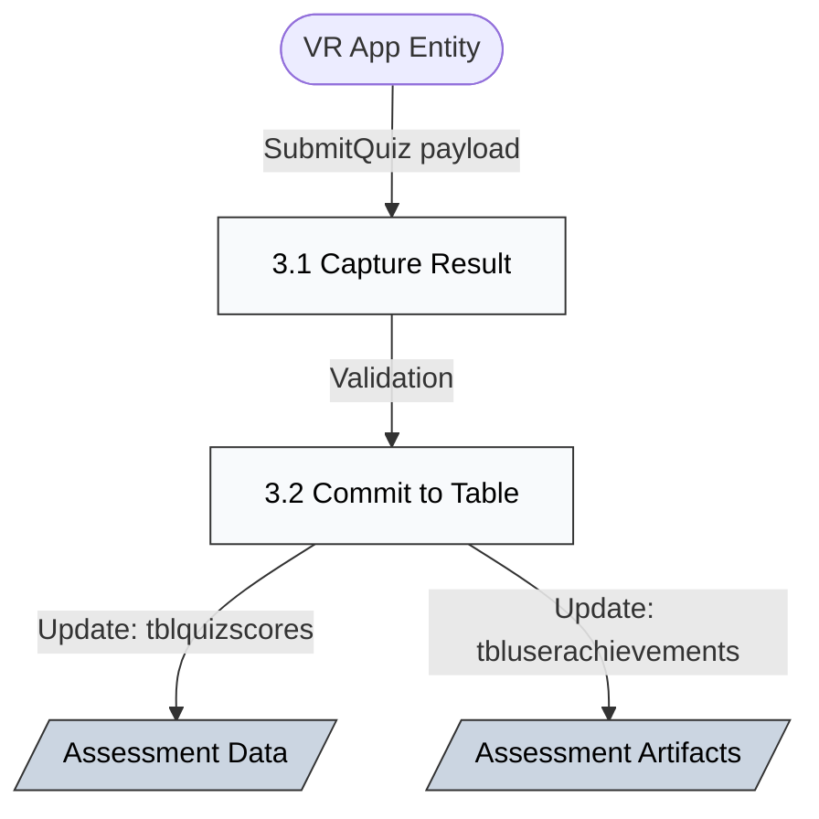
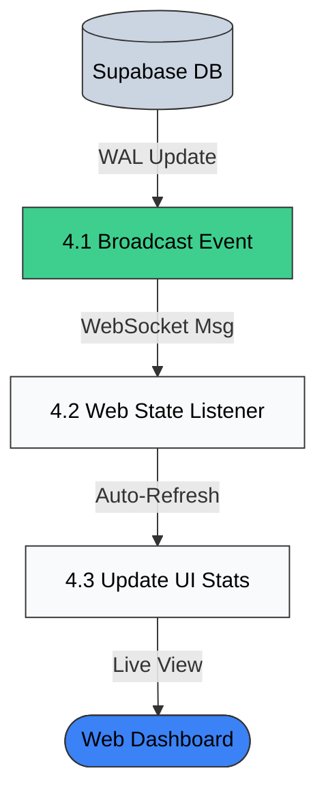

# VR Nationalian Web Portal

## Architecture
Clean Architecture with clear separation of concerns:
- Domain Layer (Entities & Repository Interfaces)
- Application Layer (Use Cases & Business Logic)
- Infrastructure Layer (Database & External Services)
- Presentation Layer (Controllers & Routes)

## Principles
- SOLID Principles
- DRY (Don't Repeat Yourself)
- Single Source of Truth
- KISS (Keep It Simple)
- YAGNI (You Aren't Gonna Need It)
- Dependency Injection
- Interface-Based Design

## Tech Stack
- Backend: Node.js v20.17.0, TypeScript, Express
- Frontend: React 18, TypeScript (TSX), Vite
- Database: Supabase (Postgres)
- Real-time: Supabase Realtime (@supabase/supabase-js)
- Authentication: bcrypt password hashing, session-based
- Package Manager: npm 10.8.3
- Icons: Lucide React
- Charts: Recharts (for analytics visualizations)
- Styling: CSS with dark theme (#111827, #1e293b, #e2e8f0)
- Fonts: Inter (UI), JetBrains Mono (code/labels)

## Features

### Authentication & Security
- Bcrypt password hashing at database level
- Role-based access control (Student/Professor/Admin)
- Session management with active/inactive tracking
- Logout functionality that deactivates sessions
- Database triggers for automatic achievement granting
- Prevents duplicate sessions per device type
- Account deactivation/archiving system with scheduled archiving
- User-friendly error messages (no technical jargon exposed to users)

### Student Portal
- Personal dashboard with progress tracking
- Chapter completion status (4 chapters)
- Achievement tracking and unlocks
- Playtime statistics
- Leaderboard access
- Profile management

### Professor Portal
- Section management (view sections with student counts)
- Student management within sections (edit and archive only)
- Student progress monitoring with clickable rows for quick access
- Achievement tracking per student
- Section statistics dashboard
- Leaderboard access
- Archive management (view and reactivate archived students)
- Bulk archive operations with scheduling
- Chapter-wise quiz score tracking
- Permission restrictions: cannot delete students, sections, or archived users

### Admin Portal
- System-wide dashboard with real-time health monitoring
- Quick insights (2x2 grid: avg students/section, logins today, most active section, chapters this week)
- Recent activity feed (5 most recent, green background, violet highlight for Master of the Realm)
- Professor management (full CRUD operations)
- Section management with deactivation/activation (admin-only)
- Student management with permanent deletion (admin-only)
- Archive management (view, reactivate, and permanently delete archived users)
- Analytics page with time-based trends and insights
- Leaderboard system access
- Bulk operations (archive, delete, deactivate sections)
- Full administrative control over all system entities

### Analytics & Insights
- Weekly completion trends (line chart)
- Chapter difficulty analysis with drop-off rates
- Achievement rarity ranking
- At-risk student alerts
- Playtime distribution
- Chapter completion rates
- Achievement unlock rates

### Leaderboard System
- Most Achievements (top 10 students with podium display)
- Fastest Completion (speedrunners who completed all 4 chapters)
- Top Sections (sections with highest completion rates)
- Podium-style top 3 with Crown/Medal/Star icons
- Rankings list for positions 4-10 with placeholders
- Available across all user roles

### UI/UX
- Dark theme design with consistent color palette
- Responsive sidebar navigation for all roles
- Modal forms for CRUD operations
- Skeleton loading states for better perceived performance
- Empty states with helpful placeholders
- Real-time data updates via Supabase
- User-friendly error messages (network issues, server errors, etc.)
- Comprehensive error handling and validation
- Lucide React icons throughout
- Role-based permission controls and UI elements
- Clickable table rows for quick navigation
- Status badges (Active/Inactive, Archived) with visual indicators
- Student count display in sections
- Bulk selection with checkboxes
- Pagination for large datasets
- Filter and search capabilities
- Success/error banners for user feedback

## System & Data Flow Architecture

The portal utilizes **Supabase Realtime** to provide instant updates. The following diagrams document the system's functional and technical flow according to standard DFD levels.

### 4.2.1 Use Case Diagram
Describes the functional interactions between actors and the real-time system.



### 4.2.2 Data Flow Diagram Level 0 (Context)
Defines the overall scope and external boundaries of the VR Nationalian System.



### 4.2.3 Data Flow Diagram Level 1 (Functional)
Breaks down the core real-time loop into four human-readable processes managing data movement from VR to Web.



### 4.2.4 Real-time Implementation Mapping
The following table maps the diagram processes to their actual locations in the source code.

| DFD Process | Code Implementation Location | Technology |
| :--- | :--- | :--- |
| **1.0 Submit Progress** | `SupabaseManager.cs` (Unity) / `LeaderboardPage.tsx` | C# / React |
| **2.0 Verify Identity** | Supabase RPC: `fn_login` | PL/pgSQL |
| **3.0 Save to Database** | Supabase RPC: `SubmitQuiz`, `CompleteChapter` | PL/pgSQL |
| **4.0 Sync Live Dashboard** | `frontend/src/utils/supabaseClient.ts` | WebSocket (Supabase) |
| **4.2 Web State Listener** | `LeaderboardPage.tsx`, `AnalyticsPage.tsx`, `StudentDashboard.tsx` | React `useEffect` |
| **4.3 Update UI Stats** | Callbacks like `fetchLeaderboards()` or `fetchStats()` | React Hooks |

### 4.2.5 Data Flow Diagram Level 2 (Process Explosions)
Technical breakdown of user validation, result archival, and the real-time sync cycle.

#### Process 2.0: Identity Verification


#### Process 3.0: Progress Archival


#### Process 4.0: Real-time Sync Loop



## Project Structure

### Backend (`/backend/src`)
```
backend/src/
├── application/
│   └── usecases/          # Business logic layer
│       ├── AnalyticsUseCase.ts
│       ├── AuthUseCase.ts
│       ├── LeaderboardUseCase.ts
│       ├── ProfessorUseCase.ts
│       ├── QuizScoreUseCase.ts
│       ├── SectionUseCase.ts
│       ├── StatsUseCase.ts
│       ├── StudentProgressUseCase.ts
│       ├── StudentUseCase.ts
│       └── UserProfileUseCase.ts
├── domain/
│   ├── entities/          # Domain models
│   │   ├── Analytics.ts
│   │   ├── Leaderboard.ts
│   │   ├── Professor.ts
│   │   ├── QuizScore.ts
│   │   ├── Section.ts
│   │   ├── StudentProgress.ts
│   │   └── User.ts
│   └── repositories/      # Repository interfaces
│       ├── IAnalyticsRepository.ts
│       ├── ILeaderboardRepository.ts
│       ├── IProfessorRepository.ts
│       ├── IQuizScoreRepository.ts
│       ├── ISectionRepository.ts
│       ├── IStudentProgressRepository.ts
│       └── IUserRepository.ts
├── infrastructure/
│   ├── database/
│   │   └── SupabaseClient.ts
│   └── repositories/      # Repository implementations
│       ├── AnalyticsRepository.ts
│       ├── LeaderboardRepository.ts
│       ├── ProfessorRepository.ts
│       ├── QuizScoreRepository.ts
│       ├── SectionRepository.ts
│       ├── StudentProgressRepository.ts
│       └── UserRepository.ts
├── presentation/
│   ├── controllers/       # Request handlers
│   │   ├── AnalyticsController.ts
│   │   ├── AuthController.ts
│   │   ├── HealthController.ts
│   │   ├── LeaderboardController.ts
│   │   ├── ProfessorController.ts
│   │   ├── QuizScoreController.ts
│   │   ├── SectionController.ts
│   │   ├── StatsController.ts
│   │   ├── StudentController.ts
│   │   ├── StudentProgressController.ts
│   │   └── UserProfileController.ts
│   └── routes/
│       └── index.ts       # API route definitions
└── index.ts               # Application entry point
```

### Frontend (`/frontend/src`)
```
frontend/src/
├── components/            # Reusable UI components
│   ├── Layout.tsx         # Main layout wrapper
│   ├── Sidebar.tsx        # Navigation sidebar
│   ├── StudentLayout.tsx  # Student-specific layout
│   ├── StudentSidebar.tsx # Student navigation
│   ├── Pagination.tsx     # Pagination component
│   ├── Skeleton.tsx       # Loading skeletons
│   └── ProtectedRoute.tsx # Route guard
├── contexts/
│   └── AuthContext.tsx    # Authentication state management
├── pages/
│   ├── admin/             # Admin-only pages
│   │   ├── AdminDashboard.tsx
│   │   ├── AdminProfessorsPage.tsx
│   │   ├── AdminStudentsPage.tsx
│   │   └── AnalyticsPage.tsx
│   ├── professor/         # Professor-only pages
│   │   ├── ProfessorDashboard.tsx
│   │   ├── SectionsPage.tsx
│   │   └── StudentsPage.tsx
│   ├── shared/            # Multi-role pages
│   │   ├── LoginPage.tsx
│   │   ├── ArchivesPage.tsx
│   │   ├── LeaderboardPage.tsx
│   │   └── ChaptersPage.tsx
│   └── student/           # Student-only pages
│       ├── StudentDashboard.tsx
│       ├── StudentAchievements.tsx
│       ├── StudentAssessments.tsx
│       └── StudentSettings.tsx
├── utils/
│   ├── errorHandler.ts    # User-friendly error handling
│   └── supabaseClient.ts  # Supabase configuration
├── App.tsx                # Root component with routing
└── main.tsx               # Application entry point
```

### Documentation (`/mds-and-sqls`)
- `database (1).md` - Complete database schema and functions
- `FEATURES.md` - Feature checklist and roadmap
- `API_DOCUMENTATION.md` - API endpoint documentation
- `USER_FRIENDLY_ERROR_HANDLING.md` - Error handling guide
- `SECTION_DEACTIVATION_GUIDE.md` - Section deactivation feature
- `ARCHIVE_IMPLEMENTATION.md` - Archive system documentation
- `LEADERBOARD_IMPLEMENTATION.md` - Leaderboard system guide
- SQL migration files for database updates

## Recent Updates

### April 2026 - Frontend Reorganization & Code Structure
- **Frontend Reorganization**: Restructured pages by role for better maintainability
  - Created role-based folders: `admin/`, `professor/`, `student/`, `shared/`
  - Moved CSS files alongside their components
  - Updated all import paths automatically
  - Improved code organization and discoverability
- **Section Management Enhancements**:
  - Added student count display in sections table
  - Implemented section deactivation (admin-only)
  - Deactivated sections remain accessible but hidden from new enrollments
  - Bulk deactivation support with checkbox selection
- **Permission System Refinements**:
  - Professors: Can only edit and archive students (no deletion)
  - Professors: Cannot edit, delete, or deactivate sections (view-only)
  - Professors: Cannot permanently delete archived users
  - Admins: Full control over all destructive operations
- **User Experience Improvements**:
  - User-friendly error messages replacing technical jargon
  - Network errors show helpful connectivity guidance
  - Clickable table rows for faster navigation
  - Status badges with visual indicators (Active/Inactive)
  - Improved bulk operations with better feedback
- **Error Handling System**:
  - Centralized error handler utility
  - Consistent error messages across all pages
  - Graceful handling of network failures
  - Better user feedback for server errors
