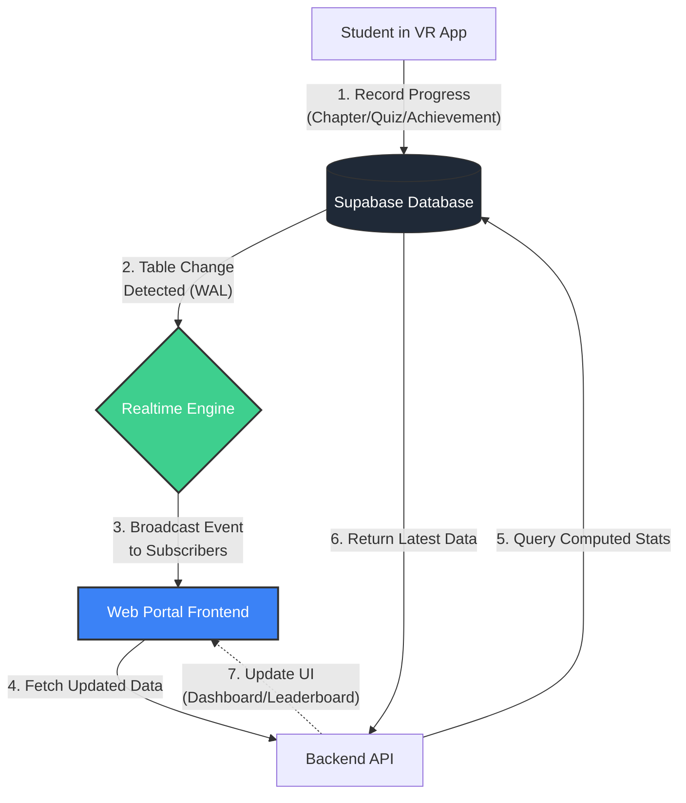
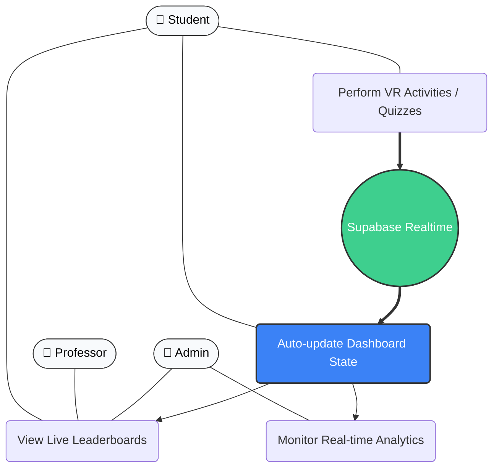

# VR Nationalian Web Portal

## Architecture
Clean Architecture with clear separation of concerns:
- Domain Layer (Entities & Repository Interfaces)
- Application Layer (Use Cases & Business Logic)
- Infrastructure Layer (Database & External Services)
- Presentation Layer (Controllers & Routes)

## Principles
- SOLID Principles
- DRY (Don't Repeat Yourself)
- Single Source of Truth
- KISS (Keep It Simple)
- YAGNI (You Aren't Gonna Need It)
- Dependency Injection
- Interface-Based Design

## Tech Stack
- Backend: Node.js v20.17.0, TypeScript, Express
- Frontend: React 18, TypeScript (TSX), Vite
- Database: Supabase (Postgres)
- Real-time: Supabase Realtime (@supabase/supabase-js)
- Authentication: bcrypt password hashing, session-based
- Package Manager: npm 10.8.3
- Icons: Lucide React
- Styling: CSS with dark theme (#111827, #1e293b, #e2e8f0)

## Features

### Authentication & Security
- Bcrypt password hashing at database level
- Role-based access control (Student/Professor/Admin)
- Session management with active/inactive tracking
- Logout functionality that deactivates sessions
- Database triggers for automatic achievement granting
- Prevents duplicate sessions per device type

### Student Portal
- Personal dashboard with progress tracking
- Chapter completion status (4 chapters)
- Achievement tracking and unlocks
- Playtime statistics
- Leaderboard access
- Profile management

### Professor Portal
- Section management (CRUD operations)
- Student management within sections
- Student progress monitoring
- Achievement tracking per student
- Section statistics dashboard
- Leaderboard access
- Archive management (view and reactivate archived students)
- Bulk archive operations with scheduling

### Admin Portal
- System-wide dashboard with real-time health monitoring
- Quick insights (2x2 grid: avg students/section, logins today, most active section, chapters this week)
- Recent activity feed (5 most recent, green background, violet highlight for Master of the Realm)
- Professor management (CRUD operations)
- Section deactivation/activation (admin-only)
- Student deletion (permanent removal, admin-only)
- Archive management (view, reactivate, and delete archived users)
- Analytics page with time-based trends
- Leaderboard system access
- Bulk operations (archive, delete, deactivate)

### Analytics & Insights
- Weekly completion trends (line chart)
- Chapter difficulty analysis with drop-off rates
- Achievement rarity ranking
- At-risk student alerts
- Playtime distribution
- Chapter completion rates
- Achievement unlock rates

### Leaderboard System
- Most Achievements (top 10 students with podium display)
- Fastest Completion (speedrunners who completed all 4 chapters)
- Top Sections (sections with highest completion rates)
- Podium-style top 3 with Crown/Medal/Star icons
- Rankings list for positions 4-10 with placeholders
- Available across all user roles

### UI/UX
- Dark theme design
- Responsive sidebar navigation for all roles
- Modal forms for CRUD operations
- Skeleton loading states
- Empty states with placeholders
- Real-time data updates
- User-friendly error messages (no technical jargon)
- Error handling and validation
- Lucide React icons throughout
- Role-based permission controls
- Clickable table rows for quick navigation
- Status badges (Active/Inactive, Archived)
- Student count display in sections
- Bulk selection with checkboxes

## Real-time Architecture

The portal utilizes **Supabase Realtime** to provide instant updates without page refreshes.

### Data Flow (The Complete Real-time Loop)

### Use Case Diagram

## Recent Updates

### March 2026 - Permission Refinements & Section Management
- **Section Deactivation**: Admins can now deactivate sections without deleting them
  - Deactivated sections remain accessible to professors and enrolled students
  - Hidden from new student enrollment
  - Can be reactivated at any time
- **User-Friendly Error Handling**: Replaced technical errors with clear, actionable messages
  - Network connectivity issues show helpful guidance
  - Server errors provide user-friendly explanations
  - Consistent error handling across all pages
- **Permission Updates**:
  - Professors can only edit and archive students (no deletion)
  - Professors cannot edit, delete, or deactivate sections
  - Professors cannot permanently delete archived users
  - All destructive actions (delete, deactivate) are admin-only
- **UX Improvements**:
  - Added student count column in sections view
  - Made entire student rows clickable for quick access
  - Added bulk operations with checkbox selection
  - Improved visual indicators with status badges
